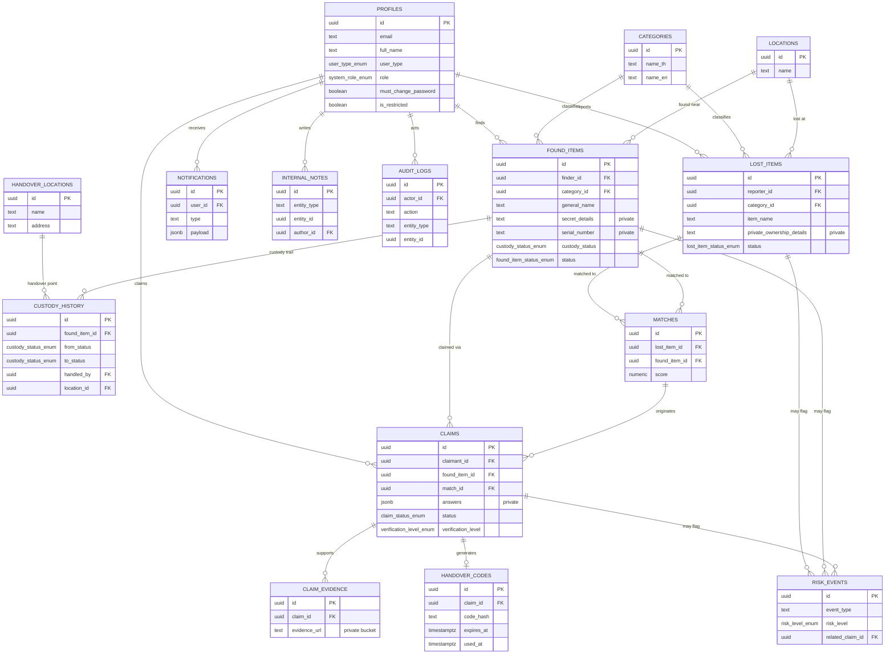

# CDTI Smart Lost & Found — ER Diagram (Phase 1)

## Information-asymmetry notes

- `found_items.secret_details` / `serial_number` / `exact_location` / `exact_time` never
  appear in `public_found_items`, in any `notifications.payload`, or in any response
  visible to a claimant. They exist only for the server-side verification checklist
  logic and staff/admin review.
- `claims` is deliberately **not** readable by the finder (`found_items.finder_id`) —
  only the claimant and staff/admin. This prevents a finder from coaching a claimant
  or vice versa.
- `public_lost_items` / `public_found_items` are Postgres views with
  `security_invoker = false`, so they expose only the whitelisted columns
  regardless of the querying role's RLS visibility on the base tables — the
  base tables themselves have **no** public/anon SELECT policy at all.
